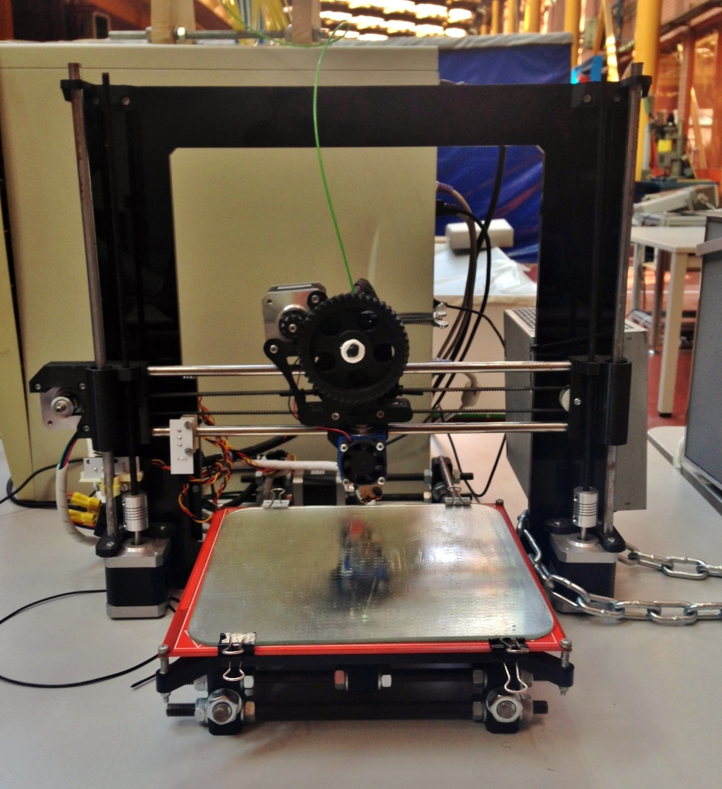
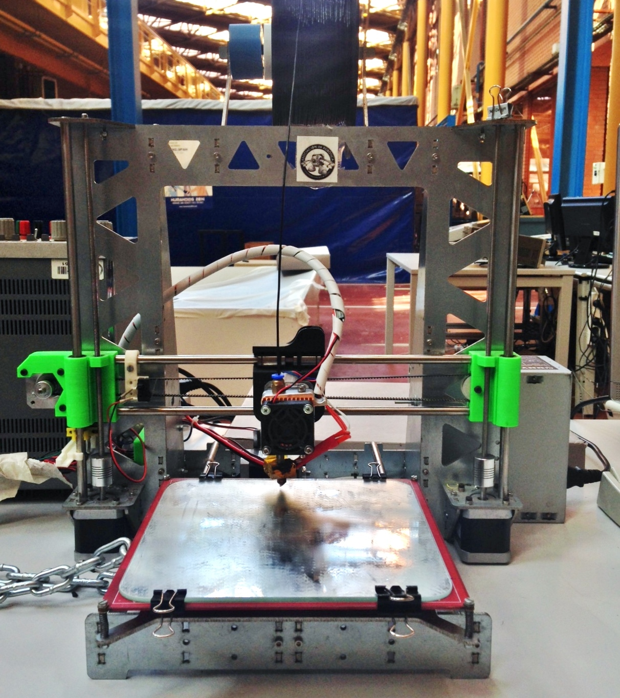

# Características de las impresoras

Las impresoras *Blacky* e *Hija Resurrection* son impresoras **Prusa i3**, es decir, son la tercera iteración del diseño de impresoras 3D prusa por el desarrollador principal de RepRap Prusajr.

Las principales mejoras principales hechas sobre la segunda iteración son:

* Rigidez del marco mejorada.
* Montaje más sencillo.
* Archivos paramétricos para múltiples tamaños de cojinetes o rodamientos.

Esta generación de impresoras 3D innova en su diseño en forma paramétrica. **No** consta de unas **medidas fijas**, luego podemos adaptarla a las necesidades del usuario cambiando archivos de configuración y volviendo a generar ficheros STL. Esta característica abre un gran abanico de posibilidades para el diseño de las impresoras.

La Prusa i3 tiene un **volumen de impresión** de 20x20x20cm (10cm más de altura que la anterior). Además tiene **menos piezas y de menor tamaño**. También es más estable en el eje X, y se construye con más rapidez.

Existen actualmente dos modelos de prusa i3, con marco de madera o con marco de otros materiales, perteneciendo las impresoras *Blacky* e *Hija Resurrection* al segundo grupo.

Para más información puede visitar estos enlaces:

* [Desarrollo de la Prusa Mendel](https://github.com/josefprusa/Prusa3)
* [Clone wars: Prusa iteración 3](http://reprap.org/wiki/Clone_wars:_Prusa_iteraci%C3%B3n_3)

Las impresoras a las que hace referencia este manual son las que se muestran en las siguientes figuras.

*Figura 1: Impresora Blacky.*

*Figura 2: Impresora Hija Resurrection, con soporte para la bobina de filamento y ventilación incorporada.

