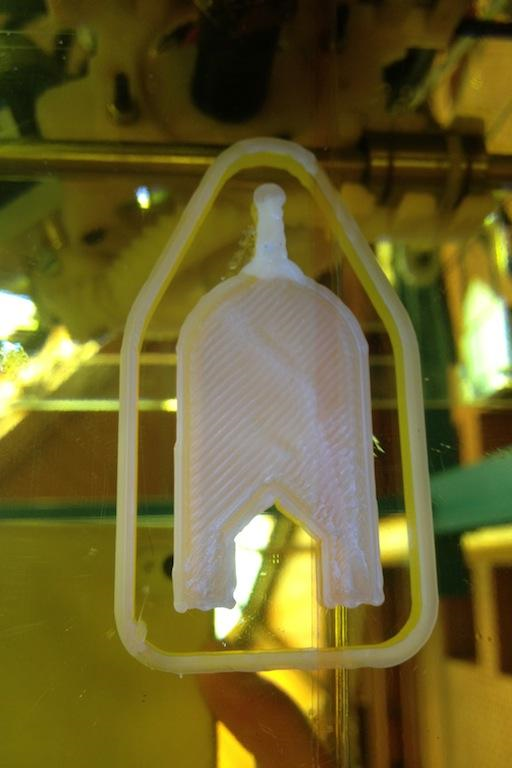

# Imprimir

Antes de darle a **Imprimir Trabajo** (símbolo de PLAY en la barra de botones superior), es recomendable extruir una vez de forma manual para que el extrusor pueda eliminar el plástico endurecido de la anterior impresión.

Para ello, ir a la pestaña **Control Manual** y en la parte inferior del menú pulsar un par de veces sobre la **flecha con sentido hacia abajo** y rótulo, **Extruye (mm): 5.**

**Retirar** el **plástico** extruido** sobrante** y **comprobar** que las **temperaturas** han alcanzado los valores estimados. Ahora sí, pulsar el botón de **Imprimir Trabajo**.

En este momento la impresora comenzará a imprimir y habrá que **estar pendiente** de la pieza por si surgen complicaciones.

---

**Recomendación:**

**Nunca dejar la impresora sin supervisión por un tiempo superior a 10-15 minutos, podría haber una complicación y romperse la impresora.**

*Figura 16: Ejemplo de una primera capa correcta*

Si la impresora dejará de echar plástico recurrir al documento [Preguntas Frecuentes](https://docs.google.com/document/d/120gY0sf4hBU7i_8BBuBpqSdxuIdomMd3wa2FF5AbxRI/pub) para intentar localizar el problema y tratar de solucionarlo. **En caso de no encontrar ahí la solución, consulta con un operador, con el profesor responsable o con el responsable de las impresoras.
**