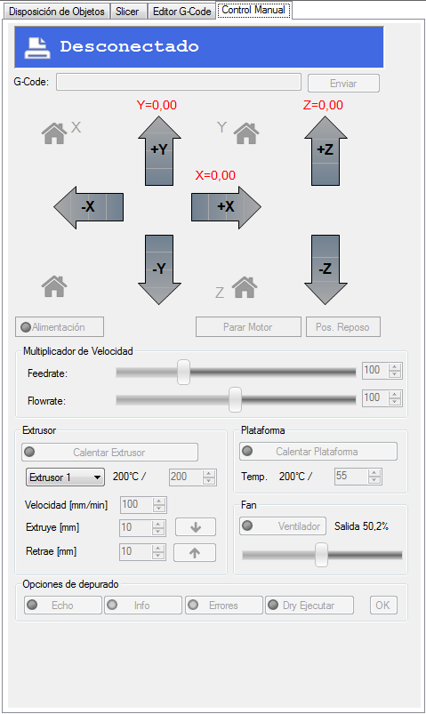

# 1. Pestaña Control Manual

En esta pestaña, como se muestra en la Figura 12, se pueden seleccionar los movimientos manuales de los motores y la asignación de las temperaturas, tanto de la base como del extrusor. Además, se puede realizar una extrusión o retracción del filamento, ya sea para realizar el cambio de una bobina de plástico o porque haya habido una obstrucción en el extrusor.

Antes de nada, pulsar los botones **Calentar Extrusor** y **Calentar Plataforma**. Las temperaturas **no** es necesario **modificarlas**.

Estas deberán estar siempre que se esté en modo manual y trabajemos con PLA en:

●	Extrusor: 180º.

●	Plataforma: 50º.
	

*Figura 12: Pestaña Control Manual.*

---

*Aunque no hay datos exactos, puesto que cada material, dependiendo del fabricante, del grosor del filamento e incluso del color, requiere unas condiciones distintas; se recomienda hacer un estudio de las temperaturas recomendadas para cada caso concreto, en lo referente al extrusor y a la cama caliente.*

*A modo de guía aproximada, se puede seguir la tabla que se muestra en este [enlace](http://wiki.ikaslab.org/index.php/File:TABLA_MATERIALES.jpg), aunque es más conveniente seguir las instrucciones del fabricante.*

---
