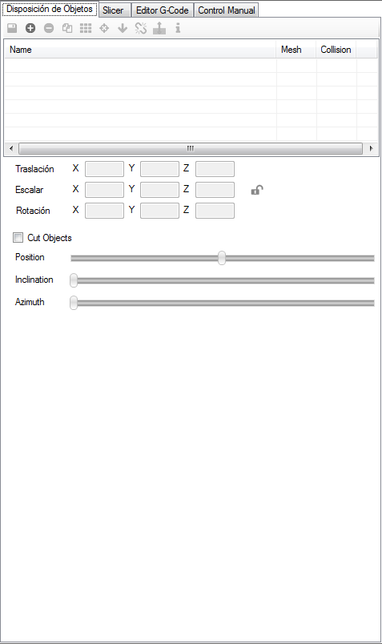
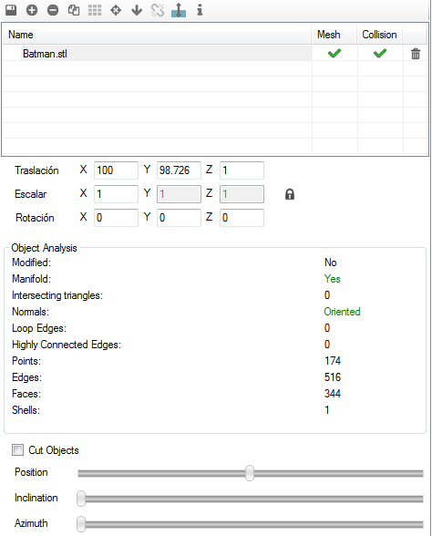
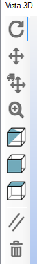
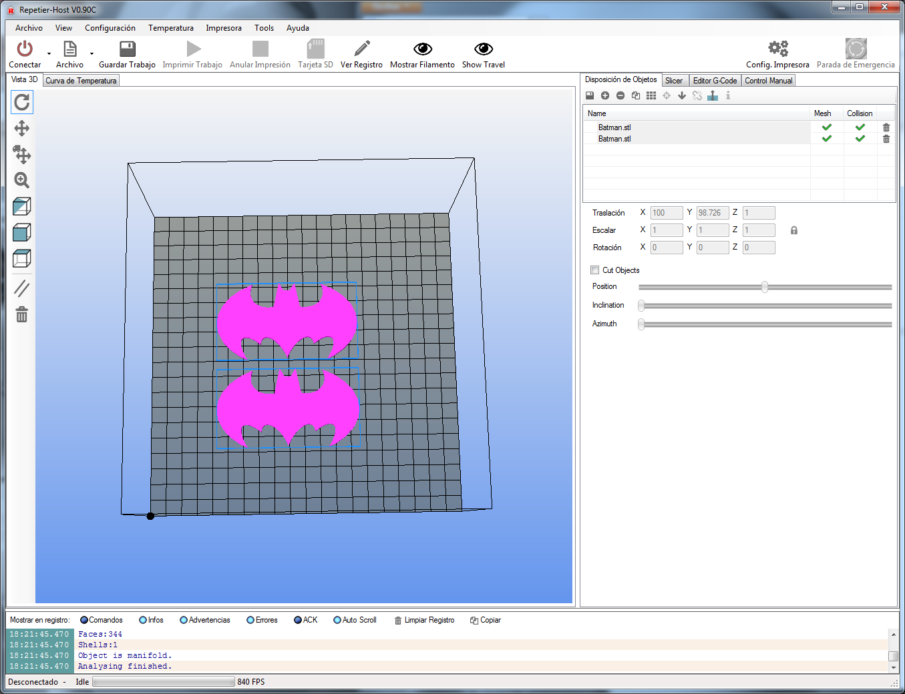

# Pestaña Disposicion de Objetos

Esta pestaña permite incorporar los distintos objetos que se van a imprimir a la plataforma virtual.
 

 
*Figura 13: Pestaña Disposición de Objetos.*

Es posible **añadir** tantas **piezas** como las dimensiones de la plataforma permitan y colocarlas de forma independiente con sólo seleccionarlas.

  
 
*Figura 14: Añadir piezas o realizar operaciones.*

Una vez incluidas todas las piezas a imprimir, se puede guardar como un **único archivo STL** con el **botón de guardar**, situado en el menú contextual debajo del nombre de la pestaña.

Para **añadir** las** piezas** a la plataforma, se pulsa el botón con **símbolo (+)**. Cada vez que se añada o se duplique una nueva pieza, **automáticamente** se **autoposicionarán** en la base. Los botones siguientes también son muy útiles, ya que permiten **posicionar** la pieza sobre la base y la **centrarla**, en caso de que no lo estén.

En este menú se puede rotar y trasladar las piezas para un mejor posicionamiento. En este caso, estas operaciones se tendrán que realizar de manera numérica, teniendo que escribir cada uno de los valores.

*Figura 15: Barra de operaciones manuales.*

En la siguiente imagen se puede observar cómo quedarían las piezas en la vista 3D.

*Figura 15: Vistas de pieza 3D.*