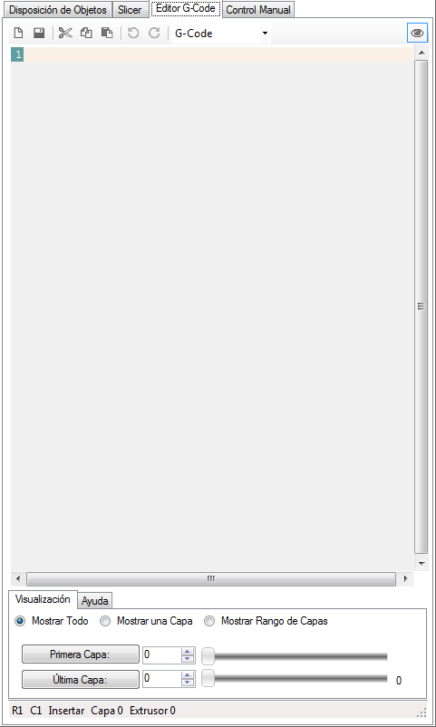
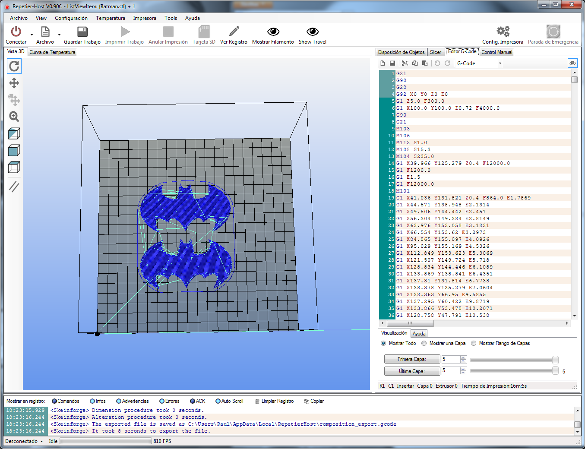

# Pestaña Editor G-Code (Guardar G-Code)

Al contrario que otros programas, el G-Code generado con RepetierHost, **no se guarda automáticamente**, y por ello si se desea guardar para futuras impresiones es preciso ir a la pestaña editor G-Code y pulsar sobre el botón de **guardar** (símbolo del disquete).

*Figura 14. Pestaña Editor G-Code.*

Una vez generado el G-Code, aparecerá automáticamente en esta pestaña y en la vista 3D aparecerán reposicionados, con respecto a las coordenadas de la impresora, las piezas a imprimir.

 
 
*Figura 15. Código G-Code.

