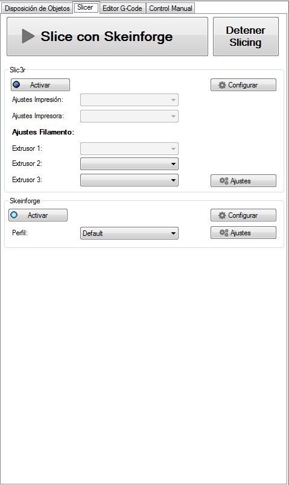
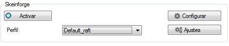
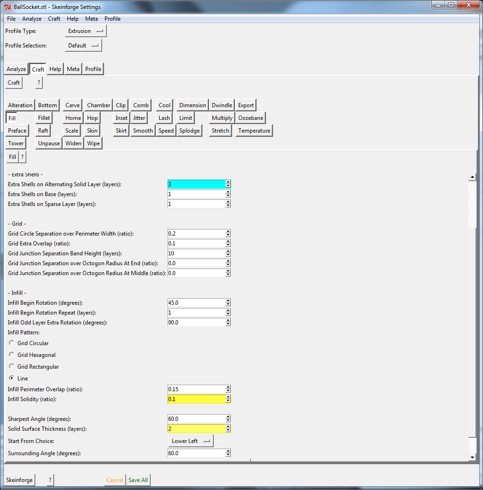

# Pestaña Slicer (Configuración del G-Code)

En esta pestaña, mostrada en la siguiente figura, se puede acceder a la configuración de la impresora para la pieza a imprimir.

*Figura 10. Pestaña Slicer.*

Es **recomendable** utilizar el perfil **Default** para las impresiones. No obstante, también existe la posibilidad de utilizar el perfil **Default_raft** para impresiones con material de soporte.
 

*Figura 11. Perfil Default_raft.*

Una vez seleccionado el perfil de Skeinforge, es posible configurar el relleno de las piezas y las capas del perímetro exterior. En la zona de Skeinforge, pulsar el botón **Configurar**.

Aparecerá una nueva interfaz en la que se podrán seleccionar características avanzadas. La má importante es **Fill**. Si selecciona dicho botón se desplegará un menú en la parte de abajo con distintas opciones. Interesan los campos **Extra Shells on Alternating Solid Layer** **(layers)**, que es el número de capas exteriores o perímetros; y **Infill Solidity (ratio)**, que es el porcentaje de relleno en tanto por uno.

---

***Recomendación:***

***Utilizar entre 1 y 3 layers para el extra shell; y entre 0.05 y 0.8 para el infill. Este rango de valores es más que adecuado, intentar no sobrepasarlo.***

---

 

*Figura 12. Configuración avanzada Skeinforge.*

Por último, guardar el estado de las modificaciones pulsando **Save All** y cerrar la ventana. En la pestaña en la que estábamos, darle al botón **Slice con Skeinforge** para generar el **G-Code**. Aparecerá una ventana mientras se genera.

 
*Figura 13. Generando el G-Code.*
