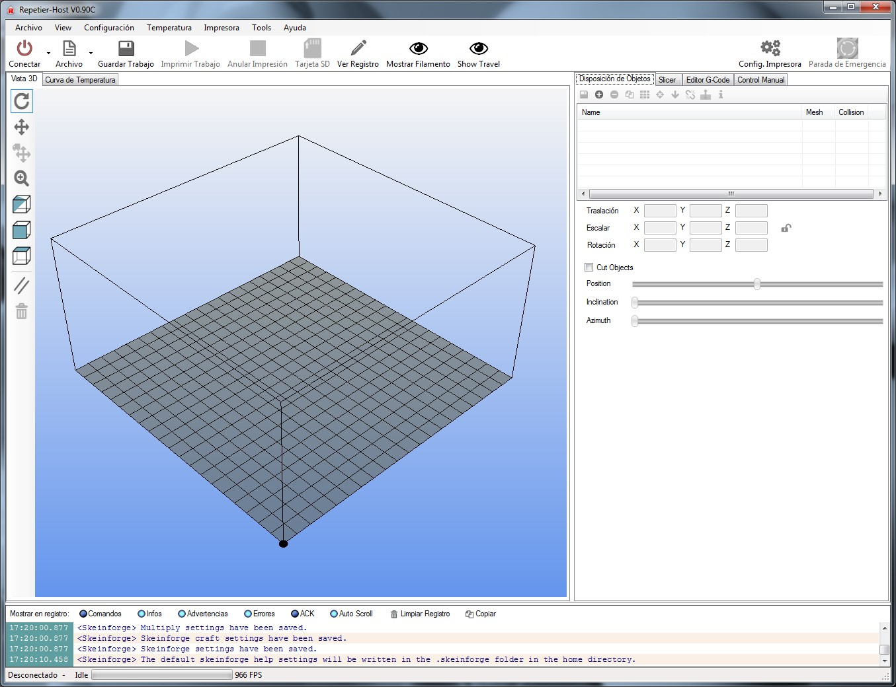
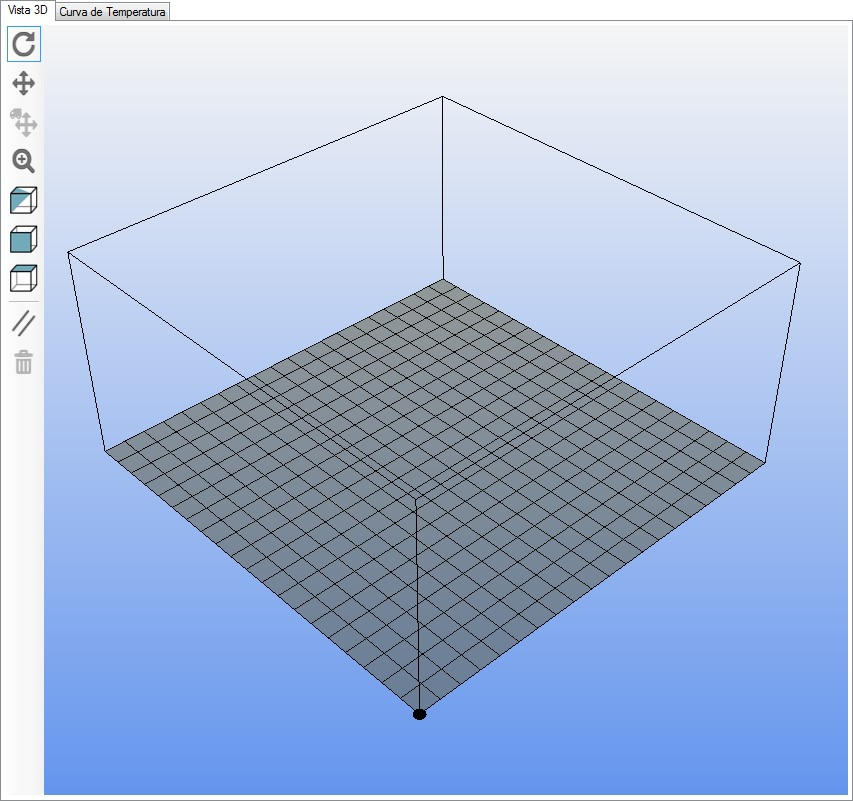
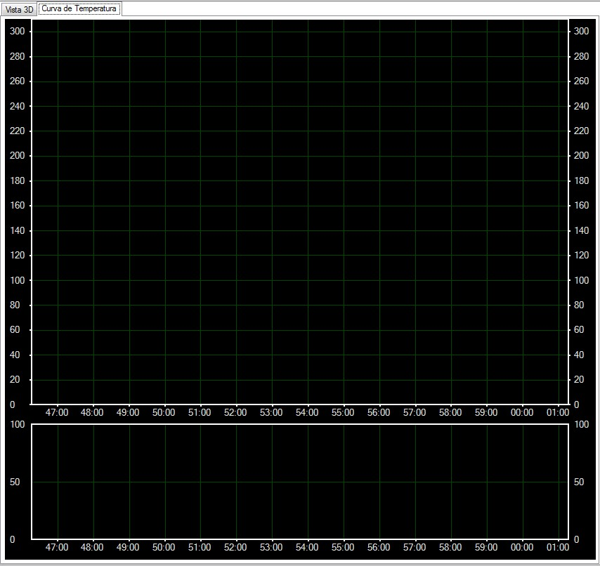
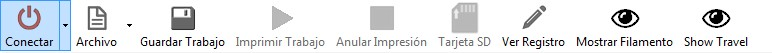
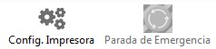

# Primeros pasos

### 1- **Abrir el programa de Repetier-Host**

Para abrir el programa que controla la impresora, hacer doble click en el icono del Escritorio  “Repetier-Host”. Obsérvese el icono del software en la Figura 6.

*Figura 6: Acceso directo a Repetier-Host.*

En ese momento se abrirá el programa y se mostrará la interfaz mostrada en la siguiente figura.

*Figura 7: Interfaz de Repetier-Host.*

Esta pantalla contiene dos vistas principales, una con la vista 3d de la pieza a imprimir, y otra con las curvas de temperaturas tanto de la base como del extrusor. Las temperaturas se podrán observar también en la barra de estado de la parte de abajo de la interfaz, una vez haya conexión.

En las siguientes imágenes se muestran ambas vistas:

*Figura 8: Vista 3D.*

*Figura 9: Visca de curvas de temperatura.*

### 2- **Conexión Ordenador - Impresora**

Este es el primer paso cuando se desea trabajar con una impresora 3D.

Se debe comprobar que el **cable USB** está **conectado** de la impresora al ordenador. Una vez comprobado, encender la impresora presionando el interruptor situado en la parte inferior de la fuente de alimentación, a la derecha de la impresora.

Para establecer la conexión entre el ordenador y la impresora 3D, hacer click en el icono **Conectar**, situado arriba a la izquierda del programa. Se puede identificar en la siguiente figura.

*Figura 10: Barra del software Repetier Host.*

Al final de esta barra de botones, se encuentra también el botón de **Parada de Emergencia**, este botón se utilizará en el caso de que haya habido algún problema con la impresora, su funcionamiento se basa en resetear la placa controladora de la impresora e inicializar la conexión.

*Figura 11: Final de la barra del software Repetier Host.*

---

**Recuerda**

*Si te surge alguna duda o problema que no pueda responderte ni este, ni ningún otro manual, solicita [ayuda](http://ieee.uc3m.es/index.php/Operadores#Operadores_Autorizados) a algún operador, al becario correspondiente o a tu profesor responsable; y hazlo saber para que pueda aparecer la respuesta a tu duda en alguno de los manuales.*

---

**A tener en cuenta**

*A pesar de que en ambos  manuales se detalla el correcto uso de las impresoras mediante el software Repetier-Host en un entorno de Windows XP, eventualmente, en el laboratorio de robótica de la UC3M se comenzará a trabajar con el software Cura en el sistema Lubuntu, para más información visite los ANEXOS del Manual de Mantenimiento de estas impresoras.*

