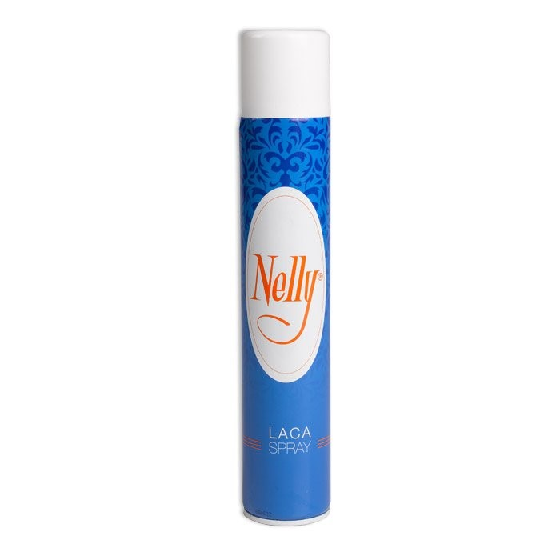
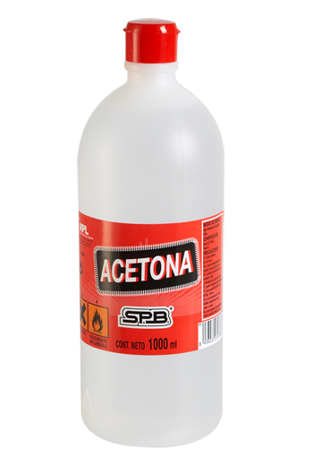
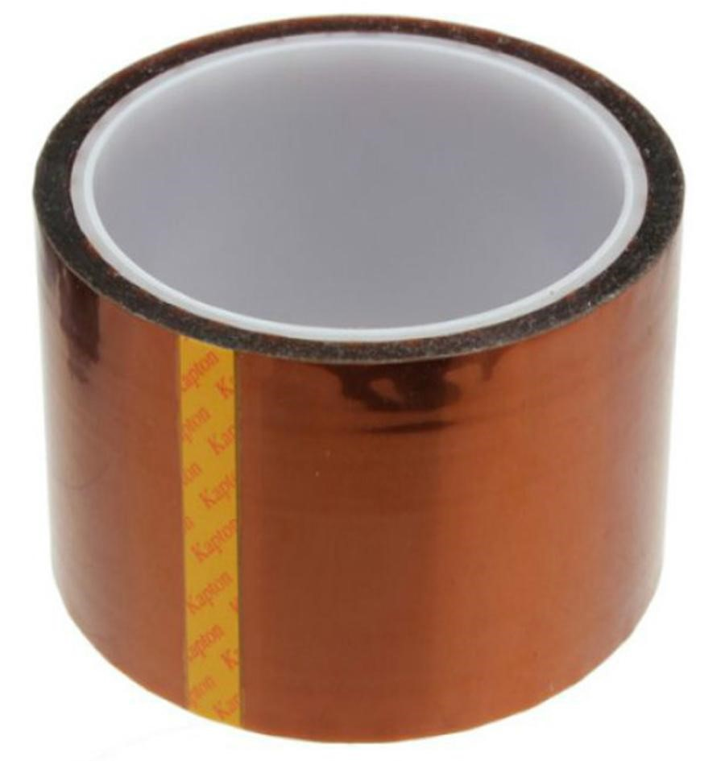

# Recomendaciones previas

Antes de comenzar a usar la impresora 3D, “HIJA”, debemos tener en cuenta una serie de consideraciones o recomendaciones.

### ** 1- Fijación de piezas a la base caliente**

Existen varias maneras de conseguir una correcta fijación de las piezas a imprimir en la base caliente. Algunas de estas son las siguientes.

* **LACA**

El uso de laca es un método que ofrece mejores resultados y cuya fijación es eficaz para la mayoría de las piezas. Este es el método de fijación más utilizado en el laboratorio por su buena relación con el PLA.

Para evitar que se despegue la pieza a medida que se está imprimiendo, se puede utilizar laca (probado con laca marca Nelly). Se debe esparcir una ligera capa sobre la base antes de comenzar a imprimir, para un mejor agarre del plástico en la base.

*Figura 3: Laca Nelly.*

* **ACETONA**

Uno de los métodos más populares para la fijación del ABS. El procedimiento de utilización es el siguiente:

2.	Disolver en acetona un pequeño trozo de ABS del mismo color que se está imprimiendo.
3.	Extender ligeramente utilizando un pincel (resistente a la acetona).
4.	Esparcir por las esquinas de la primera capa de la pieza de manera que la acetona toque tanto la pieza como la base.

No es necesario pausar la impresión. Tampoco es necesario esperar a que se haga la primera capa entera si se conoce dónde se va a imprimir la pieza exactamente.

*Figura 4: Botella de acetona.*

* **KAPTON**

Es el método más arcaico. Totalmente válido pero que no da unos resultados muy buenos para piezas con paredes finas o esquinadas. Se utiliza principalmente con el ABS, pues necesita una sujección más fuerte a la cama caliente. 

*Figura 5: Rollo de Kapton."

---

*Por la introducción del uso del PLA en el Laboratorio de Robótica de la UC3M -siendo este un plástico que se adhiere mucho mejor a la cama caliente- el Kapton y la acetona han pasado a estar en deshuso.*

---

### 2- Recomendaciones previas del  *Manual de Mantenimiento*

Existen unos pasos relacionados con el mantenimiento de la impresora previo al proceso de impresión de una pieza que pueden mejorar notablemente la calidad de funcionamiento de nuestro dispositivo. Se recomienda leer con detenimiento [Recomendaciones previas - Manual de mantenimiento Impresoras 3D modelos i3](https://asrobuc3m.gitbooks.io/impresoras-maintenance-manual-i3/content/recomendaciones_previas.html).

